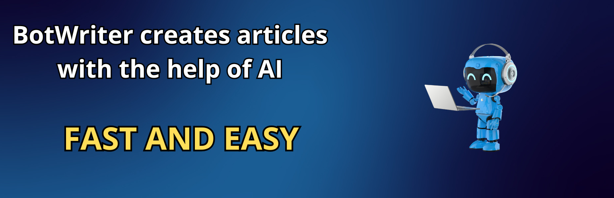
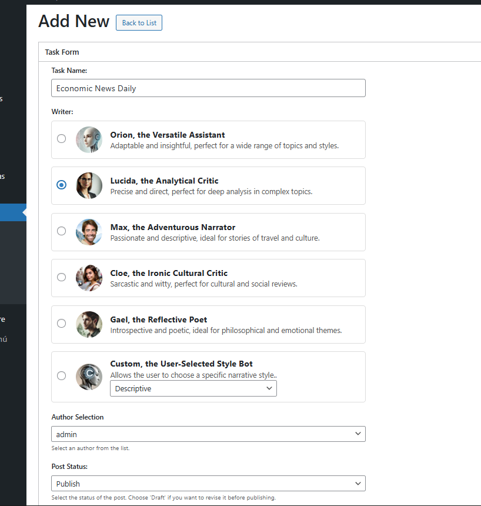
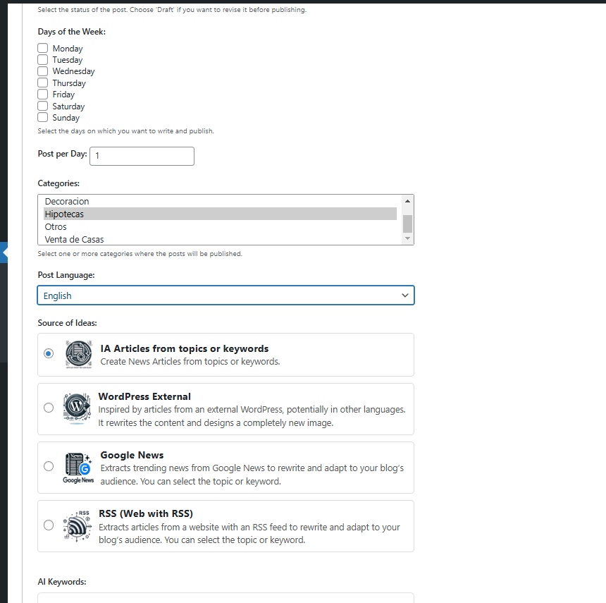
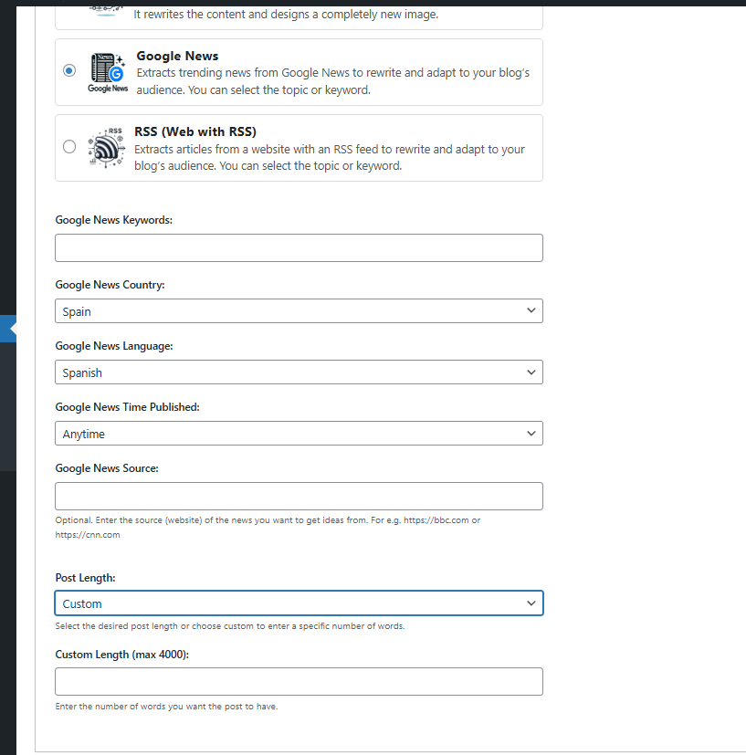
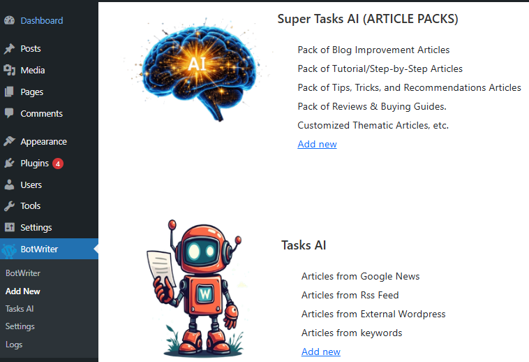

	

	
  
	 
  
	
	
	
	= PHP 7.0" />
	

# BotWriter

> Automate WordPress post creation and publishing with AI (OpenAI). Schedule tasks, generate SEO‑ready titles, content, tags and images, and publish automatically.

## ✨ Features

- Automatic publishing: schedule daily/weekly posts (via WP‑Cron, every 30 min).
- 100% original content: AI‑generated text with coherent images per post.
- SEO built‑in: titles, tags and prompts designed for ranking.
- Quick setup: simple interface, ready in minutes.
- OpenAI models: GPT‑5, GPT‑5 mini, GPT‑5 nano, GPT‑4.1, GPT‑4.1 mini, GPT‑4.1 nano, GPT‑4o, GPT‑4o mini (default: `gpt-4o-mini`).
- Sources: your keywords, RSS, news feeds and other WP sites.

## 🎬 Video demos

	
	
	 
	

## 📝 Description

Keeping a blog updated is time‑consuming. BotWriter uses your OpenAI API key to write and publish posts for you. It can:

- Write articles from keywords, RSS or news.
- Generate images matching each post topic.
- Rewrite existing content to keep it unique and fresh.
- Publish directly or save as draft on your schedule.

Made for non‑technical users with powerful options for advanced users. No paid service required: you use your own OpenAI key.

## 🚀 Installation

1. Upload `botwriter.zip` to `/wp-content/plugins/`.
2. Activate the plugin from WordPress “Plugins” menu.
3. Go to “BotWriter → Settings” and set your OpenAI key and preferences.

## ⚙️ Quick setup

1. Paste your OpenAI key in “Settings” and save.
2. Enable/disable the plugin cron as you prefer.
3. Create a task in “BotWriter → Add New” (language, length, source, writer).
4. Set days and frequency (times per day). Done!

## 🔄 How it works

1. A cron (every 30 min) checks which tasks should run.
2. Each task generates title, content, tags and image according to its config.
3. Content is published (or saved as draft) and events are logged.

Key files:
- `botwriter.php` – plugin bootstrap, menus, cron, AJAX.
- `includes/settings.php` – settings, validation and options storage.
- `includes/posts.php` and `includes/addnew.php` – create/list tasks.
- `includes/super.php` – advanced tasks.
- `assets/js/*.js` – admin scripts and AJAX.

## 🖼️ Screenshots

	
	
	 
	
	
  

## ✅ Requirements

- WordPress 4.0+ (tested up to 6.8)
- PHP 7.0+
- OpenAI API key

## 🔐 Privacy & Security

- Admin screens protected with `current_user_can()`.
- Forms and AJAX with nonce and sanitization.
- We don’t collect personal data; you use your own OpenAI key.

## 📌 Changelog (highlights)

- 1.4.1 – Select OpenAI models (e.g., GPT‑5 / 4.1 / 4o) and image quality.
- 1.4.0 – Fully free plan; use your own OpenAI key.
- 1.3.x – “Super Tasks”, better scheduling, tutorial videos.
- 1.2.9 – Changes for WordPress.org guidelines.

For the full changelog see `readme.txt`.

## 🤝 Support

- Website: https://www.wpbotwriter.com
- Issues: open an issue in this repo.

---

# BotWriter (Español)

> Automatiza la creación y publicación de artículos en WordPress usando IA (OpenAI). Programa tareas, genera textos, títulos, etiquetas e imágenes optimizadas para SEO, y publica de forma automática.

## ✨ Características

- Publicación automática: programa artículos a diario o semanalmente (via WP‑Cron, cada 30 min).
- Contenido 100% original: textos generados por IA con imágenes coherentes por entrada.
- SEO integrado: títulos, etiquetas y prompts orientados a posicionamiento.
- Configuración rápida: interfaz simple, lista en minutos.
- Modelos OpenAI: GPT‑5, GPT‑5 mini, GPT‑5 nano, GPT‑4.1, GPT‑4.1 mini, GPT‑4.1 nano, GPT‑4o, GPT‑4o mini (por defecto: `gpt-4o-mini`).
- Fuentes: palabras clave propias, RSS, noticias y otros sitios WP.

## 🎬 Demos en YouTube

	
	
	 
	

## 📝 Descripción

Mantener un blog actualizado lleva tiempo. BotWriter usa tu clave de OpenAI para redactar y publicar entradas por ti. Puede:

- Escribir artículos a partir de palabras clave, RSS o noticias.
- Generar imágenes asociadas al tema del post.
- Reescribir contenido existente para mantenerlo único y actualizado.
- Publicar directamente o guardar como borrador en el horario que definas.

El plugin está pensado para no técnicos y ofrece opciones avanzadas para usuarios exigentes. No requiere servicios de pago propios: usas tu propia clave de OpenAI.

## 🚀 Instalación

1. Sube el archivo `botwriter.zip` a `/wp-content/plugins/`.
2. Activa el plugin en el menú «Plugins» de WordPress.
3. Ve a «BotWriter → Ajustes» y configura tu clave de OpenAI y preferencias.

## ⚙️ Configuración rápida

1. En «Ajustes», pega tu clave de OpenAI y guarda.
2. Activa/desactiva el cron del plugin según prefieras.
3. Crea una tarea en «BotWriter → Add New» eligiendo idioma, longitud, fuente y escritor.
4. Define días y frecuencia (veces al día). ¡Listo!

## 🔄 ¿Cómo funciona?

1. Un cron (cada 30 min) evalúa qué tareas deben ejecutarse.
2. Cada tarea genera título, contenido, etiquetas e imagen según su configuración.
3. El contenido se publica automáticamente (o se guarda como borrador) y se registran eventos en la tabla de logs.

Archivos clave:
- `botwriter.php` – bootstrap del plugin, menús, cron, AJAX.
- `includes/settings.php` – ajustes, validación y guardado de opciones.
- `includes/posts.php` y `includes/addnew.php` – creación y listado de tareas.
- `includes/super.php` – tareas avanzadas.
- `assets/js/*.js` – scripts de administración y AJAX.

## 🖼️ Capturas de pantalla

	
	
	 
	
	
  

## ✅ Requisitos

- WordPress 4.0+ (probado hasta 6.8)
- PHP 7.0+
- Clave de API de OpenAI

## 🔐 Privacidad y seguridad

- Entradas de administración protegidas con `current_user_can()`.
- Formularios y AJAX con `nonce` y sanitización.
- No recopilamos datos personales; usas tu propia clave de OpenAI.

## 📌 Changelog (resumen)

- 1.4.1 – Selección de modelos OpenAI (p. ej., GPT‑5 / 4.1 / 4o) y calidad de imagen.
- 1.4.0 – Plan 100% libre; usas tu propia clave de OpenAI.
- 1.3.x – «Super Tasks», mejoras de horario y vídeos tutoriales.
- 1.2.9 – Ajustes para cumplir directrices de WordPress.org.

Para el registro completo consulta `readme.txt`.

## 🤝 Soporte

- Web: https://www.wpbotwriter.com
- Incidencias: crea un issue en este repositorio.

---

© GPLv2 o posterior. Hecho con ❤️ para WordPress.